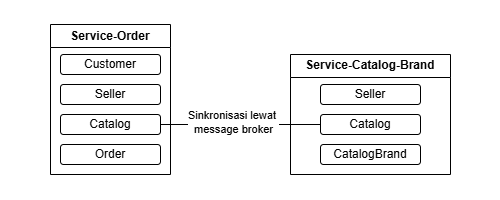

# WinVMJ-microservice-composer

---
Proyek ini adalah sebuah eksperimen untuk memnderivasi produk dalam microservices dengan tujuan untuk menambah variabilitas di tingkat arsitektur. Studi kasus yang digunakan adalah studi kasus webshop yang diambil dari repository `winvmj-webshop` branch `dev/afra`, lebih spesifiknya berusaha memecah varian produk `FullFeature` ke beberapa service berbeda. **Project ini merupakan project terpisah dari WinVMJ Composer**.

## Pendefinisian Service

---
Tiap service yang dibentuk dapat terdiri dari satu atau lebih fitur yang dapat ditentukan oleh pengguna dengan mendefinisikannya dalam file [service-def.json](resources/service-def.json). Contoh definisi sebuah service adalah sebagai berikut.
```json
{
  "services": [
    {
      "productName": "ServiceCatalog",
      "productModule": "webshop.product.servicecatalog",
      "features": [
        {
          "spl": "webshop",
          "feature": "CatalogBrand"
        },
        {
          "spl": "webshop",
          "feature": "CatalogFilter"
        }
      ]
    }
  ]
}
```
Pada contoh di atas hanya didefinsikan sebuh service catalog yang terdiri dari dua varian fitur `Catalog`, yakni `CatalogBrand` dan `CatalogFilter`. Penamaan fitur disesuikan dengan nama fitur pada file `feature_to_module.json`. Studi kasus websop merupakan suatu multi-product line karena melibatkan dua SPL yang berbeda yakni SPL `webshop` dan `paymentgateway`, sehingga ketika memilih suatu fitur perlu menuliskan juga asal SPL-nya, karena terdapat fitur yang memiliki nama yang sama dan berasal dari spl yang berbeda, contohnya fitur `CreditCard`. Walaupun pada studi kasus ini, fitur dari SPL`paymentgateway` bergantung pada fitur di SPL `webshop`, sehingga tidak memungkinkan memilih fitur `paymentgateway` secara mandiri.

## Derivasi Service/Product

---
Kode [MicroserviceCompiler.java](src/MicroserviceCompiler.java) digunakan untuk menderivasi berbagai service yang telah didefinisikan sebelumnya secara bersamaan. Proses derivasi service masih serupa dengan proses yang dilakukan `WinVMJ Composer`, yang membedakan adalah pada tahap komplisasi dan pengemasan module-module, dimana module tiap service harus terpisah satu sama lain agar bisa dijalankan secara independen. Secara garis besar proses kompilasi dan pengemasan module adalah sebagai berikut.
```text
FOR each service IN system DO
    FOR each feature IN service DO
        requiredModules = FIND_REQUIRED_MODULES(feature)
        sortedModules = IDENTIFY_AND_SORT_DEPENDENCIES(requiredModules)

        FOR each module IN sortedModules DO
            compiledModule = COMPILE(module)
            PACKAGE_AS_JAR(compiledModule)
        END FOR
    END FOR
END FOR
```
Pencarian dependency module memanfaatkan file `module-info`, library dari `WinVMJ` tidak akan dimasukkan dalam pencarian dependensi module, karena sudah otomatis diikutsertakan untuk tiap service.  

## Komunikasi Antar Service 

---
Karena implementasi arsitektur microservices dilakukan pada tahap derivasi, bukan pada tahap design atau modeling, hasil microservice masih bersifat "gemuk". Hal ini dikarenakan module yang menjadi dependensi module lainnya akan diduplikasi dimana-mana, contohnya adalah sebagai berikut.  


Pada gambar di atas, module `Seller` dan `Catalog` diduplikasi di tiap service, karena masing-masing membutuhkan module tersebu. Untuk memanfaatkan kondisi tersebut, komunikasi akan dilakukan secara asynchronous, menggunakan message broker, RabbitMQ. Pemilihan komunikasi ini dikarenakan tiap servis bisa berdiri sendiri, tidak bergantung dengan service lainnya, message broker dimanfaatkan semata-mata hanya untuk sinkronisasi database antar service. 

Implementasi komunikasi antar module masih dilakukan secara manual dengan menambahkan mekanisme publish-consume pada module terkait tiga fitur utama SPL `webshop` yakni, `Catalog`, `Order`, dan `PaymentOrder`. Mekanisme publish-consume ditambahkan pada layer service tiap module, message yang dikirimkan berupa data suatu object yang diperlukan untuk memperbarui database, data disesuaikan tergantung aksi yang dilakukan, antara `create`, `update`, atau `delete`.

## Langkah Reproduksi

---
1. **Buat product module yang merepresentasikan suatu service**, ini dilakukan secara manual dengan menduplikasi product module `FullFeature` dan menghapus module-module yang tidak diperlukan, baik di main class maupun di file `module-info`.
2. **Definisikan tiap service pada file [service-def.json](resources/service-def.json)**
3. **Melakukan derivasi product dengan menjalankan [MicroserviceCompiler.java](src/MicroserviceCompiler.java)**
4. **Memindahkan file konfigurasi seperti, [hibernate.properties](resources/hibernate.properties) dan file [run.bat](resources/run.bat) ke directory service yang telah dibuat yang berada pada directory [src-gen](src-gen) dan menyesuaikan isinya**
5. **Jalankan RabbitMQ Server**, dapat menggunakan docker container sebagai berikut.
    ```sh
    docker run -it --rm --name rabbitmq -p 5672:5672 -p 15672:15672 rabbitmq:4.0-management
    ```
7. **Set environment variable dan jalankan tiap service dengan mengeksekusi file `run.bat` pada tiap service.**


## Integration Testing dengan Postman

---
Integration testing dilakukan dengan beberapa skenario yang didefinisikan pada file postman collection yang dapat diakses di directory [test](resources/test). Test dipenuhi oleh empat service yang saling bekerja sama yang telah didefinikan pada file [service-def.json](resources/service-def.json). Keempat service tersebut antara lain:
- `ServiceCatalog`
- `ServiceOrder`
- `ServicePaymentOrderCreditCard`
- `ServicePaymentOrderEWallet`

Beikut ini adalah langkah-langkah untuk menjalankan test.

Jika **Newman** belum terinstal, jalankan perintah berikut:
```sh
npm install -g newman
```
Untuk menjalankan test, jalankan perintah berikut:
```sh
newman run WebShop_Integration_Test.postman_collection.json
```


## Batasan

---
- Mekanisme komunikasi hanya tersedia pada module core fitur `Catalog`, `Order`, dan `PaymentOrder`, sehingga jika terdapat fitur varian di beberapa servic berbeda, maka sinkronisasi database tidak akan terjadi.
- Tidak ada module untuk fitur `CancelOrder` yang didefinisikan pada varian product `FullFeature`, hal ini terjadi karena kesalahan penamaan pada file [feature_to_module.json](resources/webshop/feature_to_module.json), sehingga module tersebut tidak digenerate pada produk `FullFeature`
